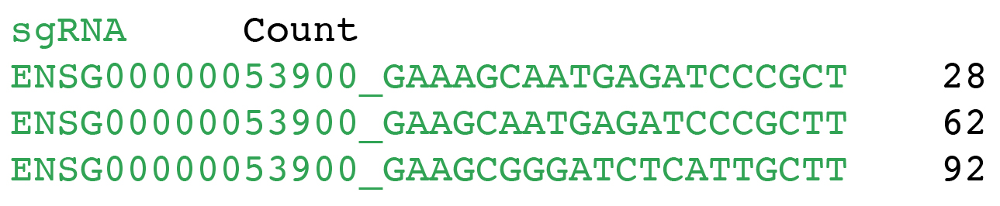
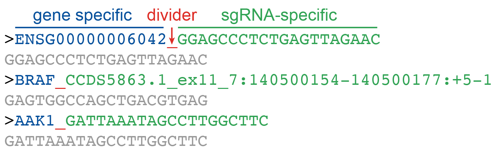

CRISPRAnalyzeR
============================

We will use [CRISPRAnalyzeR](https://github.com/lintian0616/CRISPRAnalyzeR), a fully-interactive and exploratory analysis, to perform CRISPR Screening Analysis.

## Installation

We will first install [Docker](https://docs.docker.com/engine/install/ubuntu/) Engine on Ubuntu. First, initiate a new instance (e.g., **Ubuntu 18.04 GUI XFCE Base**) from CyVerse, which must be > 16.04.

* Set up the repository

```
sudo apt-get update

sudo apt-get install apt-transport-https ca-certificates curl gnupg-agent software-properties-common
```

* Add Docker’s official GPG key

```
curl -fsSL https://download.docker.com/linux/ubuntu/gpg | sudo apt-key add -
```

Verify that you now have the key with the fingerprint:

```
sudo apt-key fingerprint 0EBFCD88
```

The result should be:

```
pub   rsa4096 2017-02-22 [SCEA]
      9DC8 5822 9FC7 DD38 854A  E2D8 8D81 803C 0EBF CD88
uid           [ unknown] Docker Release (CE deb) <docker@docker.com>
sub   rsa4096 2017-02-22 [S]
```

* Set up the stable repository

```
sudo add-apt-repository "deb [arch=amd64] https://download.docker.com/linux/ubuntu $(lsb_release -cs) stable"
```

* Install Docker Engine

```
sudo apt-get update
sudo apt-get install docker-ce docker-ce-cli containerd.io
```

* Install CRISPRAnalysis

```
sudo docker run --rm -p 8000:8000 boutroslab/crispranalyzer:latest
```

* Run CRISPRAnalysis

In terminal, type:

```
## change XX
sudo docker run --rm -e proxy_url="128.196.142.XX" -e proxy_port=80 -p 8000:8000 boutroslab/crispranalyzer:latest
```

In web browser (e.g., chrome), type:

```
## change XX
http://128.196.142.XX:8000/CRISPRAnalyzeR/
```

## sgRNA quantification

Although CRISPRAnalyzeR can use fastq file as input, the web interface will limit the size of the file to be uploaded. Therefore, it is recommended to quantify the sgRNA first, just using the python script we use for checking sgRNA coverage in the library.

Before running `count_spacers.py`, we need to check:

* whether seed is `CGAAACACC`
* whether a guanine exists before the guide spacer sequence

Below is the example of an input fastq file.


For spacer sequence file , only keep the column of spacer sequence. Also delete the column names so that the first row is already spacer sequence.

```
FASTQ1=/home/lintian0616/vol_1T/LiShuo/Sample_R20025914-A549-C/R20025914-A549-C_combined_R2.fastq

FASTQ2=/home/lintian0616/vol_1T/LiShuo/Sample_R20025914-A549-T/R20025914-A549-T_combined_R2.fastq

SPACER=/home/lintian0616/CRISPR_Screening/count_spacers_files/broadgpp-brunello-library-contents-human-spacer.csv

python ~/CRISPR_Screening/count_spacers.py -f $FASTQ1 -o A549_C.csv -i $SPACER

python ~/CRISPR_Screening/count_spacers.py -f $FASTQ2 -o A549_T.csv -i $SPACER
```

Once the quantification is done, we will use [R](https://www.r-project.org/) to prepare the input files.

To install R, please refer to **Gitbucket** -> **cluster_usage** -> **InstallR.md**

```
sudo apt-get update
sudo apt-get install r-base
```

Add the line below to `/etc/apt/sources.list`.

```
deb http://cloud.r-project.org/bin/linux/ubuntu bionic-cran40/
```

We then add key.

```
sudo apt-key adv --keyserver keyserver.ubuntu.com --recv-keys 51716619E084DAB9
sudo add-apt-repository ppa:marutter/rdev
```

Finally, we can update and install Rstudio.

```
sudo apt-get update
sudo apt-get install r-base
sudo apt-get install r-base-dev

# rstudio
sudo apt-get install gdebi-core
wget https://download2.rstudio.org/server/xenial/amd64/rstudio-server-1.3.1056-amd64.deb
sudo gdebi rstudio-server-1.3.1056-amd64.deb
```

To start Rstudio Server, type `http://128.196.142.XX:8787/` in the web browser.

The final txt file looks like this:



```{r}
# Spacer 
spacer <- "/home/lintian0616/CRISPR_Screening/count_spacers_files/broadgpp-brunello-library-contents-human.csv"
spacer.csv <- read.csv(spacer, header=TRUE, stringsAsFactors=FALSE)
spacer.csv$sgRNA <- paste(spacer.csv$Target.Gene.Symbol, spacer.csv$sgRNA.Target.Sequence, sep="_")

# count
A549_C <- "/home/lintian0616/vol_1T/LiShuo/Sample_R20025914-A549-C/A549_C.csv"
A549_C.csv <- read.csv(A549_C, header=FALSE, stringsAsFactors=FALSE)
A549_C.csv <- A549_C.csv[match(spacer.csv$sgRNA.Target.Sequence, A549_C.csv$V1), ]
all.equal(spacer.csv$sgRNA.Target.Sequence, A549_C.csv$V1)
A549_C.df <- data.frame(sgRNA=spacer.csv$sgRNA, count=A549_C.csv$V2)
write.table(A549_C.df, file="A549_C.count.txt", quote=FALSE, sep="\t", row.names=FALSE, col.names=TRUE)

A549_T <- "/home/lintian0616/vol_1T/LiShuo/Sample_R20025914-A549-T/A549_T.csv"
A549_T.csv <- read.csv(A549_T, header=FALSE, stringsAsFactors=FALSE)
A549_T.csv <- A549_T.csv[match(spacer.csv$sgRNA.Target.Sequence, A549_T.csv$V1), ]
all.equal(spacer.csv$sgRNA.Target.Sequence, A549_T.csv$V1)
A549_T.df <- data.frame(sgRNA=spacer.csv$sgRNA, count=A549_T.csv$V2)
write.table(A549_T.df, file="A549_T.count.txt", quote=FALSE, sep="\t", row.names=FALSE, col.names=TRUE)
```

## sgRNA fasta file

We also need to prepare sgRNA fasta file as the input, which looks like this:



```{r}
# Spacer 
spacer <- "/home/lintian0616/CRISPR_Screening/count_spacers_files/broadgpp-brunello-library-contents-human.csv"
spacer.csv <- read.csv(spacer, header=TRUE, stringsAsFactors=FALSE)
spacer.csv$sgRNA <- paste(spacer.csv$Target.Gene.Symbol, spacer.csv$sgRNA.Target.Sequence, sep="_")

## fasta file
spacer.csv$sgRNA_fasta <- paste0(">", spacer.csv$sgRNA)
spacer.fasta <- spacer.csv[, c("sgRNA_fasta", "sgRNA.Target.Sequence")]
write.table(spacer.fasta, file="spacer.fasta", quote=FALSE, sep="\n", row.names=FALSE, col.names=FALSE)
```

## 