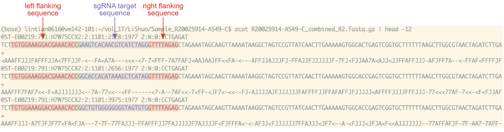

CRISPR Screening Analysis
============================

We will use [CRISPRAnalyzeR](https://github.com/lintian0616/CRISPRAnalyzeR), a fully-interactive and exploratory analysis, to perform CRISPR Screening Analysis.

## Installation

We will first install [Docker](https://docs.docker.com/engine/install/ubuntu/) Engine on Ubuntu. First, initiate a new instance (e.g., **Ubuntu 18.04 GUI XFCE Base**) from CyVerse, which must be > 16.04.

* Set up the repository

```
sudo apt-get update

sudo apt-get install apt-transport-https ca-certificates curl gnupg-agent software-properties-common
```

* Add Docker’s official GPG key

```
curl -fsSL https://download.docker.com/linux/ubuntu/gpg | sudo apt-key add -
```

Verify that you now have the key with the fingerprint:

```
sudo apt-key fingerprint 0EBFCD88
```

The result should be:

```
pub   rsa4096 2017-02-22 [SCEA]
      9DC8 5822 9FC7 DD38 854A  E2D8 8D81 803C 0EBF CD88
uid           [ unknown] Docker Release (CE deb) <docker@docker.com>
sub   rsa4096 2017-02-22 [S]
```

* Set up the stable repository

```
sudo add-apt-repository "deb [arch=amd64] https://download.docker.com/linux/ubuntu $(lsb_release -cs) stable"
```

* Install Docker Engine

```
sudo apt-get update
sudo apt-get install docker-ce docker-ce-cli containerd.io
```

* Install CRISPRAnalysis

```
sudo docker run --rm -p 8000:8000 boutroslab/crispranalyzer:latest
```

* Run CRISPRAnalysis

In terminal, type:

```
## change XX
sudo docker run --rm -e proxy_url="128.196.142.XX" -e proxy_port=80 -p 8000:8000 boutroslab/crispranalyzer:latest
```

In web browser (e.g., chrome), type:

```
## change XX
http://128.196.142.XX:8000/CRISPRAnalyzeR/
```

## sgRNA quantification

Although CRISPRAnalyzeR can use fastq file as input, the web interface will limit the size of the file to be uploaded. Therefore, it is recommended to quantify the sgRNA first, just using the python script we use for checking sgRNA coverage in the library.

Before running `count_spacers.py`, we need to check:

* whether seed is `CGAAACACC`
* whether a guanine exists before the guide spacer sequence

Below is the example of an input fastq file.



For spacer sequence file , only keep the column of spacer sequence. Also delete the column names so that the first row is already spacer sequence.

```
FASTQ=/home/lintian0616/vol_1T/LiShuo/Sample_R20025914-A549-C/R20025914-A549-C_combined_R2.fastq

SPACER=/home/lintian0616/CRISPR_Screening/count_spacers_files/broadgpp-brunello-library-contents-human-spacer.csv

python ~/CRISPR_Screening/count_spacers.py -f $FASTQ -o output.csv -i $SPACER
```

