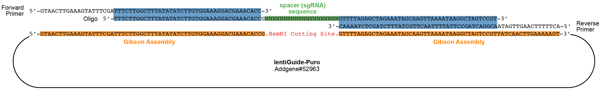

CRISPR Screening (computational part)
================================

This is a tutorial adapted from [Nature Protocol paper](https://www.nature.com/articles/nprot.2017.016).

## Install Packages

### pip

We will use [pip](https://pypi.org/) to install three packages, **twobitreader** and **biopython**.

If `pip` is not installed, we will update packages and install `pip` first.

```
sudo apt update
sudo apt install python-pip
pip --version
```

If `pip` is installed, upgrade `pip` to the latest version.

```
sudo pip install --upgrade pip
```

Then, we will use `pip` to install the following packages.

```
sudo pip install twobitreader
sudo pip install biopython
```

We also need to install [dryscrape](https://dryscrape.readthedocs.io/en/latest/) package.

```
sudo apt-get install qt5-default libqt5webkit5-dev build-essential python-lxml xvfb

sudo pip install dryscrape
```

### install from source

The source files can be found at directory of `source`.

* [biopython](https://github.com/biopython/biopython/releases)

```
python setup.py build
python setup.py test
sudo python setup.py install
```

### Seqmap

For [seqmap](http://www-personal.umich.edu/~jianghui/seqmap/), install the version **1.0.13** source code for all platforms and compile with the command.

```
wget http://www-personal.umich.edu/~jianghui/seqmap/download/seqmap-1.0.13-src.zip

unzip seqmap-1.0.13-src.zip

## compile
g++ -O3 -m64 -o seqmap match.cpp
```

We then add `seqmap` to the working directory.

```
export PATH=$PATH:/home/lintian0616/seqmap-1.0.13-src
```

## Generate Library

### a library targeting a custom set of genomic coordinates

* Prepare target gene list

Prepare Gene List below in a *csv* format. The **target_genes.csv** file should contain the headers **name**, **chrom**, **start**, and **end**.

|  name   |  chrom  |   start  |    end   |
|:-------:|:-------:|:--------:|:--------:|
|  *EGFR* |   chr7  | 55086525 | 55086725 |
| *LPAR5* |  chr12  |  6745297 |  6745497 |
| *GPR35* |   chr2  | 241544625| 241544825|
 
* run **design_library.py**

Download genome 2bit file (e.g. [hg38.2bit](http://hgdownload.cse.ucsc.edu/goldenPath/hg38/bigZips/hg38.2bit)) to construct a database of off-target scores based on the position and distribution of mismatches between each spacer sequence and similar sequences in the genome.

For each region in the target genes *csv* file, the **design_library.py** Python script will identify potential sgRNAs and select a specified number of sgRNAs with fewer potential off-target sites using this database for the custom library.
 
Here is the example command:

```
python design_library.py -o final_guides.csv -i hg38 -g target_genes.csv -gc 25 -s 20 -n 3 -gecko
```

**1.** `-o`: Output **csv** file with names for target genes, spacer sequences, spacer orientations, chromosome locations, cleavage site locations, off-target scores, and oligo library sequences in columns from left to right (default: **final_guides.csv**)

**2.** `-i`: Prefix of input genome 2-bit file (default: **hg19**)

**3.** `-g`: Target-gene **csv** file

**4.** `-gc`: Minimum GC content required for an sgRNA spacer sequence (default: **25**)

**5.** `-s`: Minimum spacing required between cleavage sites of sgRNAs targeting the same genomic region (default: **20**)

**6.** `-n`: Maximum number of guides selected targeting each gene in the target-gene **csv** file (default: **3**)

**7.** `-gecko`: add flanking sequences to the spacers for the oligo library synthesis

When designing sgRNAs against large genomic regions (>50 kb), we recommend splitting the target-gene **csv** file into several files containing different subsets of the target genes to parallelize the library design process and minimize run time.  **It is estimated that the program will take 48 hours to complete.** The spacers that target the specified genomic coordinates will be written to an output **csv** file.

### a library an existing library

* Prepare a `csv` file containing the names of the target genes, with each line corresponding to one gene.

* Prepare another `csv` file for the annotated genome-scale library, with the names of each gene in the first column and the respective spacer sequences in the second column. Each line contains a different spacer sequence. The gene names in the target genes file should be in the same format as the names of the annotated library file.

* run **design_targeted_library.py**

Here is the example command:

```
python design_targeted_library.py -o selected_sgRNAs_from_library.csv -l sabatini_library_targets.csv -g target_genes_2.csv -gecko
```

**1.** `-o`: Output **csv** file with names for target genes, corresponding spacer sequences, and oligo library sequences in columns from left to right (default: **oligos.csv**)

**2.** `-l`: Annotated library **csv** file with names in the first column and corresponding spacer sequences in the second column (default: **annotated_library.csv**)

**3.** `-g`: Target-gene **csv** file

**4.** `-gecko`: add flanking sequences to the spacers for the oligo library synthesis

## Available CRISPR Libraries

* Genome-wise libraries
[Doench](https://sites.google.com/broadinstitute.org/doench/home) lab and [Root](https://www.broadinstitute.org/bios/david-root) lab

|  CRISPR   |  Species  |   Link   |
|:-------:|:-------:|:-------:|
| knockout |  Human | [Brunello](https://www.addgene.org/pooled-library/broadgpp-human-knockout-brunello/) |
| activation | Human |  [Calabrese](https://www.addgene.org/pooled-library/broadgpp-human-crispra-calabrese-p65hsf/) |
| inhibition | Human | [Dolcetto](https://www.addgene.org/pooled-library/broadgpp-human-crispri-dolcetto/) |
|  knockout | Mouse | [Brie](https://www.addgene.org/pooled-library/broadgpp-mouse-knockout-brie/) |
| activation | Mouse |  [Caprano](https://www.addgene.org/pooled-library/broadgpp-mouse-crispra-caprano-p65hsf/) |
| inhibition | Mouse | [Dolomiti](https://www.addgene.org/pooled-library/broadgpp-mouse-crispri-dolomiti/) |
 
* Subpool libraries

|  CRISPR   |  Species  |  Lab  |   Link   |
|:-------:|:-------:|:-------:|:-------:|
| knockout | Human | [Bassik](http://bassiklab.stanford.edu/index.html) | [link](https://www.addgene.org/pooled-library/bassik-human-crispr-knockout/) |
| knockout | Human | [Sabatini](http://sabatinilab.wi.mit.edu/) | [link](https://www.addgene.org/pooled-library/sabatini-human-subpools/) |
| activation| Human | [Weissman](https://weissmanlab.ucsf.edu/index.html) | [link](https://www.addgene.org/pooled-library/weissman-human-crispra-v2-subpools/) |
| inhibition| Human | [Weissman](https://weissmanlab.ucsf.edu/index.html) | [link](https://www.addgene.org/pooled-library/weissman-human-crispri-v2-subpools/) |
|  knockout | Mouse | [Bassik](http://bassiklab.stanford.edu/index.html) | [link](https://www.addgene.org/pooled-library/bassik-mouse-crispr-knockout/) |
|  activation| Mouse | [Weissman](https://weissmanlab.ucsf.edu/index.html) | [link](https://www.addgene.org/pooled-library/weissman-mouse-crispra-v2-subpools/) |
| inhibition| Mouse | [Weissman](https://weissmanlab.ucsf.edu/index.html) | [link](https://www.addgene.org/pooled-library/weissman-mouse-crispri-v2-subpools/)
 
* Targeted Pathway libraries

| CRISPR  |  Species  |  Usage  |   Link   |
|:-------:|:-------:|:-------:|:-------:|
| knockout | Human | Kinome | [link](https://www.addgene.org/pooled-library/broadgpp-human-kinome/) |
| knockout | Human | Ras Synthetic Lethal | [link](https://www.addgene.org/pooled-library/sabatini-crispr-human-synthetic-lethal-ras/) |
|  knockout | Human | Metabolism | [link](https://www.addgene.org/pooled-library/sabatini-human-crispr-metabolic-knockout/) |
|  knockout | Human | DNA Binding Domain of TFs | [link](https://www.addgene.org/pooled-library/vakoc-lab-human-dna-binding-domain-crispr-knockout/) |
|  knockout | Human | lncRNAs | [link](https://www.addgene.org/pooled-library/wei-human-crispr-lncrna-splicing/) |
|  knockout | Human | miRNAs | [link](https://www.addgene.org/pooled-library/lin-human-crispr-mirna/) |
|activation | Human | Membrane Protein | [link](https://www.addgene.org/pooled-library/wright-lab-human-membrane-protein-activation/) |
|inhibition | Human | lncRNA | [link](https://www.addgene.org/pooled-library/weissman-human-crispri-noncoding-subpools/) |
| knockout | Mouse | Kinome | [link](https://www.addgene.org/pooled-library/broadgpp-mouse-kinome/) |
| knockout | Mouse | mtDNA | [link](https://www.addgene.org/pooled-library/xie-mouse-crispr-carm/) |
|activation|  Mouse | mTFs | [link](https://www.addgene.org/pooled-library/qi-mouse-tf-activation/) |


## amplified oligo structure



## Analyze sequencing data

We will use [SRR9926542](https://trace.ncbi.nlm.nih.gov/Traces/sra/?run=SRR9926542) as example.

```
## Retrieve data
fastq-dump -I --split-e SRR9926542
```

Download related spacer sequence file from [Addgene](https://www.addgene.org/pooled-library/broadgpp-mouse-knockout-gouda/).

```
python count_spacers.py -f ~/rstudio/SRR9926542.fastq -o output.csv -i SRR9926542.csv -no-g
```